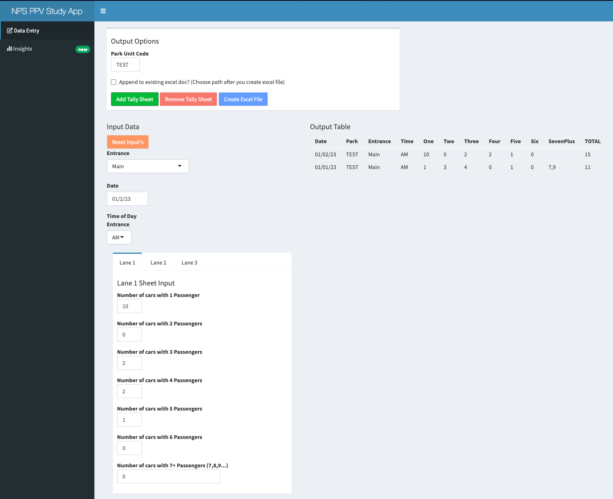

# Data entry workflow for occupancy data within the National Park Service

## Introduction
This repository contains `R` files for the `RShiny` web app that is used to enter Person Per Vehicle (PPV) data for the National Park Service.
> [!IMPORTANT]
> This app was designed by myself and is the current workflow that is being used by the National Park Service to enter PPV data.

## Overview
In order to estimate visitation to parks within the National Park Service, some parks will use vehicle counters in conjunction with PPV multipliers to get an estimate of the number of people that enter the park. This requires that the park staff survey vehicles entering the park during random sampling periods over the course of the year.
These sampling periods are 1 hour long and include representation of all days of the week, all months of the year, and all times of the day.
These data points need to converted into a consistent format that can be used for analysis.

## Motivation
Conducting PPV analysis of parks within the National Park Service can be a very time consuming task. 
Various parks may have hundreds of cars that enter every hour, entering these data points can become very tedious. 
This `RShiny` web app is used as a tool to help automate the data entry process and allow more time for analysis.

## Data Format
Below are some examples for the format of the data that is used as input and output for the app.

### Tallysheet example (input data)

| | **1**          | **2**          | **3**          | **4**          | **5**          | **6**          | **7+**          | |
|----------------|------------|------------|------------|------------|------------|------------|------------|------------------|
| **Tallymarks**| Tallymarks | Tallymarks | Tallymarks | Tallymarks | Tallymarks | Tallymarks | Tallymarks |                |
| **Total Vehicles**| 23         | 34         | 10         | 14         | 4          | 4          | 1          | **TOTAL**          |
| **Person Multiplie**| x1      | x2         | x3         | x4         | x5         | x6         | **sum of entries**  |  |
| **Total People**| 23         | 68         | 30         | 56         | 20         | 24         | 8          | **TOTAL**          |

### 2-page XLSX example (output data)
| **Observation Number** | **Entrance** | **Month** | **Date** | **Day of week** | **Time of day** | **Occupants** |
|------------------------|--------------|-----------|----------|-----------------|-----------------|--------------|
| 1                      | Main         | October   | 10/1/23  | Saturday        | PM              | 1            |
| 2                      | Main         | October   | 10/1/23  | Saturday        | PM              | 1            |
| 3                      | Main         | October   | 10/1/23  | Saturday        | PM              | 2            |
| 4                      | East         | October   | 10/1/23  | Saturday        | PM              | 1            |
| 5                      | East         | October   | 10/1/23  | Saturday        | PM              | 4            |
| 6                      | East         | October   | 10/1/23  | Saturday        | PM              | 8            |

| **Sheet Number** | **Number of Occupants** | **Entrance** | **Date** | **Month** | **Day of week** | **Time of day** |
|------------------|-------------------------|--------------|----------|-----------|-----------------|-----------------|
| 1                | 3                       | Main         | 10/1/23  | October   | Saturday        | PM              |
| 2                | 3                       | East         | 10/1/23  | October   | Saturday        | PM              |

## App Structure
The app is broken up into 2 main sections: `Data Entry` and `Insights`.
