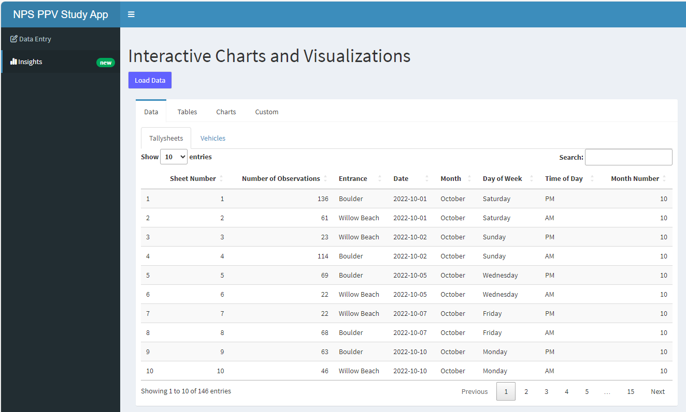

# Data entry workflow for occupancy data within the National Park Service

## Introduction
This repository contains `R` files for the `RShiny` web app that is used to enter Person Per Vehicle (PPV) data for the National Park Service.
> [!IMPORTANT]
> This app was designed by myself and is the current workflow that is being used by the National Park Service to enter PPV data.

## Overview
In order to estimate visitation to parks within the National Park Service, some parks will use vehicle counters in conjunction with PPV multipliers to get an estimate of the number of people that enter the park. This requires that the park staff survey vehicles entering the park during random sampling periods over the course of the year.
These sampling periods are 1 hour long and include representation of all days of the week, all months of the year, and all times of the day.
These data points need to converted into a consistent format that can be used for analysis.

## Motivation
Conducting PPV analysis of parks within the National Park Service can be a very time consuming task. 
Various parks may have hundreds of cars that enter every hour, entering these data points can become very tedious. 
This `RShiny` web app is used as a tool to help automate the data entry process and allow more time for analysis.
a
## Data Format
Below are some examples for the format of the data that is used as input and output for the app.

### Tallysheet example (input data)

| | **1**          | **2**          | **3**          | **4**          | **5**          | **6**          | **7+**          | |
|----------------|------------|------------|------------|------------|------------|------------|------------|------------------|
| **Tallymarks**| Tallymarks | Tallymarks | Tallymarks | Tallymarks | Tallymarks | Tallymarks | Tallymarks |                |
| **Total Vehicles**| 23         | 34         | 10         | 14         | 4          | 4          | 1          | **TOTAL**          |
| **Person Multiplie**| x1      | x2         | x3         | x4         | x5         | x6         | **sum of entries**  |  |
| **Total People**| 23         | 68         | 30         | 56         | 20         | 24         | 8          | **TOTAL**          |

### 2-page XLSX example (output data)
| **Observation Number** | **Entrance** | **Month** | **Date** | **Day of week** | **Time of day** | **Occupants** |
|------------------------|--------------|-----------|----------|-----------------|-----------------|--------------|
| 1                      | Main         | October   | 10/1/23  | Saturday        | PM              | 1            |
| 2                      | Main         | October   | 10/1/23  | Saturday        | PM              | 1            |
| 3                      | Main         | October   | 10/1/23  | Saturday        | PM              | 2            |
| 4                      | East         | October   | 10/1/23  | Saturday        | PM              | 1            |
| 5                      | East         | October   | 10/1/23  | Saturday        | PM              | 4            |
| 6                      | East         | October   | 10/1/23  | Saturday        | PM              | 8            |

| **Sheet Number** | **Number of Occupants** | **Entrance** | **Date** | **Month** | **Day of week** | **Time of day** |
|------------------|-------------------------|--------------|----------|-----------|-----------------|-----------------|
| 1                | 3                       | Main         | 10/1/23  | October   | Saturday        | PM              |
| 2                | 3                       | East         | 10/1/23  | October   | Saturday        | PM              |

## App Structure
The app is broken up into 2 main sections: `Data Entry` and `Insights`.

### Data Entry Page
Below is a screenshot of the `Data Entry` page of the app. The app was designed with the user in mind, so the app is very intuitive and easy to use. Adding and removing sheets are as simple as clicking a button.
If the user has to step away from the app, they can save their progress to an .xlsx file and append to it later. The app also automatically formats the data to the correct format. Doing this manually in Excel can allow for human error, so this is a very useful feature. Some parks have multiple lanes of traffic, so the app allows data entry for multiple lanes and automatically combines the data into a single number, (again, this is to reduce human error).

### Insights Page
The Insights Page was designed to give the end-user a quick yet powerful way to visualize and analyze their data with Poisson
regression. By uploading the data they previously entered, the app will automatically run a Poisson regression and output the results in a conditional formatted table. This gives the end-user a detailed summary of the shape of their data as well as any anomalies that may be present. If the user wants to dig deeper they can apply custom date ranges for Poisson regression and visualize it with a Gannt chart. To test wether these date ranges are statistically significant, the app will run a Poisson regression and output a graph with the mean and 95% confidence intervals. This allows for the end-user to quickly apply different combinations of date ranges to see what the best fit is for their data.

#### Data Tab

s
